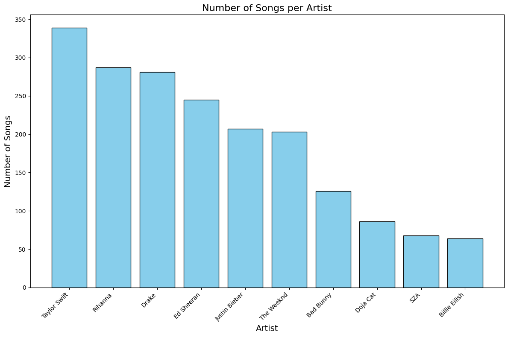

> This README is generated from a Jupyter Notebook. The code blocks and figures represent an interactive analysis.
For full, executable versions of the original notebooks, see the [raw-notebooks](./raw-notebooks) folder in the project root.

# Pop Music Trend Analysis – PySpark & Machine Learning

This notebook explores whether a song’s **Spotify popularity score** can be predicted using its **audio features** (e.g. tempo, valence, danceability, energy). We analyze the discographies of 10 top global artists using PySpark for distributed processing and machine learning for predictive modeling. The analysis moves from raw data ingestion and EDA to predictive modeling using both regression and classification approaches.

## Project Summary

- **Goal**: Predict song popularity based on known audio features.
- **Tech Stack**: PySpark, Pandas, Matplotlib, scikit-learn.
- **Models Used**:
  - Regression: Linear Regression, Random Forest Regressor
  - Classification: Logistic Regression, Decision Tree, Random Forest
- **Best Performance**: Classification using Random Forest (66% accuracy)
- **Outcome**: Framing popularity as a binary classification task led to stronger predictive power than regression.

---


## 🗂️ Notebook Structure

This notebook is divided into four major phases:

**Phase 1:** Data Preparation and Setup – Covers the Spotify API, Colab Spark setup, and data cleaning/preprocessing.

**Phase 2:** Exploratory Data Analysis (EDA) – Visual analyses of tempo, key, and audio feature trends across top artists.

**Phase 3:** Predicting Popularity via Regression Modeling – Uses linear regression and ensemble techniques to predict Spotify popularity as a continuous variable.

**Phase 4:** Predicting Popularity via Classification Modeling – Reframes popularity as a binary classification task using Logistic Regression, Decision Tree, and Random Forest models.

---


## 🔗 Table of Contents

- [Phase 1: Data Preparation and Setup](#phase-1-data-preparation-and-setup)
  - [Data Source](#data-source-extracting-audio-features-from-spotifys-web-api)
  - [Spark Setup](#spark-setup-in-google-colab)
  - [Loading & Combining Data](#loading--combining-data)
  - [Data Cleaning & Preprocessing](#data-cleaning--preprocessing)
- [Phase 2: Exploratory Data Analysis (EDA)](#phase-2-exploratory-data-analysis-eda)
  - [Number of Songs per Artist](#-number-of-songs-per-artist)
  - [Distribution of Song Tempos](#-distribution-of-song-tempos)
  - [Key & Mode Analysis](#key--mode-analysis)
  - [Feature Relationships](#feature-relationships--popularity-analysis)
- [Phase 3: Predicting Popularity via Regression Modeling](#phase-3-predicting-popularity-via-regression-modeling)
- [Phase 4: Predicting Popularity via Classification Modeling](#phase-4-predicting-popularity-via-classification-modeling)
- [📚 References](#-references)


# Phase 1: Data Preparation and Setup
## Data Source: Extracting Audio Features from Spotify's Web API  
The dataset used in this analysis was collected via the **Spotify Web API**, which provides audio feature data such as **tempo, valence, danceability, energy, and key signatures**.  
Each track’s metadata and audio attributes were retrieved programmatically in JSON format and converted into structured CSV files.

> Note: The API implementation is not included in this notebook for brevity, but it involved querying track details, handling authentication, and transforming JSON responses into tabular data.


## Spark Setup in Google Colab
**Requirements:**
- ✅ A Google Colab environment
- ✅ Approx. **3GB free RAM** (since Spark runs in-memory)
- ✅ Files stored in **Google Drive** (mounted in `/content/drive/`)

<details> <summary>Click to expand Spark setup code</summary>
```python
!apt-get install openjdk-8-jdk-headless -qq > /dev/null
```


```python
!wget https://dlcdn.apache.org/spark/spark-3.3.3/spark-3.3.3-bin-hadoop3.tgz
```

    --2023-11-08 01:29:46--  https://dlcdn.apache.org/spark/spark-3.3.3/spark-3.3.3-bin-hadoop3.tgz
    Resolving dlcdn.apache.org (dlcdn.apache.org)... 151.101.2.132, 2a04:4e42::644
    Connecting to dlcdn.apache.org (dlcdn.apache.org)|151.101.2.132|:443... connected.
    HTTP request sent, awaiting response... 200 OK
    Length: 299426263 (286M) [application/x-gzip]
    Saving to: ‘spark-3.3.3-bin-hadoop3.tgz’
    
    spark-3.3.3-bin-had 100%[===================>] 285.55M   118MB/s    in 2.4s    
    
    2023-11-08 01:29:49 (118 MB/s) - ‘spark-3.3.3-bin-hadoop3.tgz’ saved [299426263/299426263]
    


```python
!tar -xvf spark-3.3.3-bin-hadoop3.tgz
```

Spark installation output omitted for brevity.


```python
!pip install findspark
```

    Collecting findspark
      Downloading findspark-2.0.1-py2.py3-none-any.whl (4.4 kB)
    Installing collected packages: findspark
    Successfully installed findspark-2.0.1


```python
import os
os.environ["JAVA_HOME"] = "/usr/lib/jvm/java-8-openjdk-amd64"
os.environ["SPARK_HOME"] = "/content/spark-3.3.3-bin-hadoop3"
```


```python
import findspark
findspark.init()
```


```python
findspark.find()
```


    '/content/spark-3.3.3-bin-hadoop3'


```python
from pyspark.sql import SparkSession

spark = SparkSession.builder\
        .master("local")\
        .appName("Colab")\
        .config('spark.ui.port', '4050')\
        .getOrCreate()
```


```python
sc = spark.sparkContext
```


```python
test = sc.parallelize([1, 2, 3, 4, 5])
test.map(lambda x: (x, x**2)).collect()
```


    [(1, 1), (2, 4), (3, 9), (4, 16), (5, 25)]


```python
from google.colab import drive
drive.mount('/content/drive')

```

    Mounted at /content/drive

</details>

## Loading & Combining Data

```python
#List of file names
file_names = ['the_weeknd.csv', 'taylor_swift.csv', 'sza.csv', 'rihanna.csv', 'justin_bieber.csv', 'ed_sheeran.csv', 'drake.csv', 'doja_cat.csv', 'billie_eilish.csv', 'bad_bunny.csv']

# Initialize an empty DataFrame to union all your DataFrames
combined_df = None

# Loop over the file names, read each into a DataFrame, and combine them
for file_name in file_names:
    file_path = f'/content/drive/My Drive/raw-csvs-top-10/{file_name}'
    # Read the CSV file into a DataFrame
    df = spark.read.csv(file_path, header=True, inferSchema=True)
    # Union the DataFrames
    if combined_df is None:
        combined_df = df
    else:
        combined_df = combined_df.union(df)

# Now `combined_df` contains all the data from the 10 CSV files
combined_df.show(5)  # Show the first 5 rows
```

    +--------------------+--------------------+--------------------+--------------------+--------------+-------------------+-------------+----------+--------------------+-------------------+--------------------+------------+------+---+--------+----+-----------+------------+----------------+--------+-------+-------+--------------+
    |          Spotify ID|          Artist IDs|          Track Name|          Album Name|Artist Name(s)|       Release Date|Duration (ms)|Popularity|            Added By|           Added At|              Genres|Danceability|Energy|Key|Loudness|Mode|Speechiness|Acousticness|Instrumentalness|Liveness|Valence|  Tempo|Time Signature|
    +--------------------+--------------------+--------------------+--------------------+--------------+-------------------+-------------+----------+--------------------+-------------------+--------------------+------------+------+---+--------+----+-----------+------------+----------------+--------+-------+-------+--------------+
    |2ye9iWj5V4g6k6HFe...|1Xyo4u8uXC1ZmMpat...|High For This - O...|House Of Balloons...|    The Weeknd|2011-03-21 00:00:00|       249102|        68|spotify:user:1213...|2023-10-09 20:53:51|canadian contempo...|       0.466| 0.403|  4| -10.441|   0|     0.0502|        0.59|         9.51E-5|     0.1| 0.0967| 75.033|             4|
    |4Yw8TyBm9J8cpy2gu...|1Xyo4u8uXC1ZmMpat...|What You Need - O...|House Of Balloons...|    The Weeknd|2011-03-21 00:00:00|       206421|        72|spotify:user:1213...|2023-10-09 20:53:51|canadian contempo...|       0.638| 0.335|  7| -10.522|   0|     0.0854|       0.505|          0.0139|   0.116| 0.0608|133.853|             4|
    |2r7BPog74oaTG5shN...|1Xyo4u8uXC1ZmMpat...|House Of Balloons...|House Of Balloons...|    The Weeknd|2011-03-21 00:00:00|       407315|        74|spotify:user:1213...|2023-10-09 20:53:51|canadian contempo...|       0.662| 0.511|  0|  -8.419|   1|     0.0342|     0.00237|          0.0036|   0.275|  0.228| 88.989|             4|
    |4jBfUB4kQJCWOrjGL...|1Xyo4u8uXC1ZmMpat...|The Morning - Ori...|House Of Balloons...|    The Weeknd|2011-03-21 00:00:00|       314109|        74|spotify:user:1213...|2023-10-09 20:53:51|canadian contempo...|       0.682|  0.51|  6|  -9.987|   0|     0.0441|       0.143|         4.46E-6|  0.0797|  0.191|120.097|             4|
    |00aqkszH1FdUiJJWv...|1Xyo4u8uXC1ZmMpat...|Wicked Games - Or...|House Of Balloons...|    The Weeknd|2011-03-21 00:00:00|       325305|        72|spotify:user:1213...|2023-10-09 20:53:51|canadian contempo...|       0.606|  0.57|  9|  -6.684|   1|      0.032|      0.0217|         8.47E-6|   0.301|  0.258|114.033|             4|
    +--------------------+--------------------+--------------------+--------------------+--------------+-------------------+-------------+----------+--------------------+-------------------+--------------------+------------+------+---+--------+----+-----------+------------+----------------+--------+-------+-------+--------------+
    only showing top 5 rows
    


## Data Cleaning & Preprocessing

```python
from pyspark.sql.functions import col, split

row_count_before_clean = combined_df.count()
print(f"The number of rows before data cleaning is: {row_count_before_clean}")

# List of top 10 artist names:
top_10_artist_names = ["The Weeknd", "Taylor Swift", "SZA", "Rihanna", "Justin Bieber", "Ed Sheeran", "Drake", "Doja Cat", "Billie Eilish", "Bad Bunny"]

# 1. Filter entries where the first artist listed in "Artist Name(s)" is one of the top 10 artists
filtered_df = combined_df.withColumn("FirstArtist", split(col("Artist Name(s)"), ",").getItem(0)) \
                         .filter(col("FirstArtist").isin(top_10_artist_names))

# 2. Remove duplicates based on 'Track Name'
no_duplicates_df = filtered_df.dropDuplicates(["Track Name"])

# 3. Remove live versions of songs
# Filter out rows where 'Track Name' contains "- Live" or "Live Version"
cleaned_df = no_duplicates_df.filter(~col("Track Name").like("%- Live%") &
                                     ~col("Track Name").like("%Live Version%"))

row_count_clean = cleaned_df.count()
print(f"Removed duplicates, live versions, and tracks where the top 10 artist is NOT a primary artist.")
print(f"The number of rows after data cleaning is: {row_count_clean}")

```

    The number of rows before data cleaning is: 3084
    Removed duplicates, live versions, and tracks where the top 10 artist is NOT a primary artist.
    The number of rows after data cleaning is: 1906


# Phase 2: Exploratory Data Analysis (EDA)
### Number of Songs per Artist

```python
import matplotlib.pyplot as plt

# Make sure your DataFrame column names match, particularly "FirstArtist" here
artist_song_counts = cleaned_df.groupBy(col("FirstArtist")).count()

# Convert to Pandas DataFrame for plotting
artist_song_counts_pd = artist_song_counts.toPandas()

# Sort the data
artist_song_counts_pd.sort_values(by='count', ascending=False, inplace=True)

# Plotting
plt.figure(figsize=(12, 8))
plt.bar(artist_song_counts_pd['FirstArtist'], artist_song_counts_pd['count'], color='skyblue', edgecolor ='black')
plt.xlabel('Artist', fontsize=14)
plt.ylabel('Number of Songs', fontsize=14)
plt.title('Number of Songs per Artist', fontsize=16)
plt.xticks(rotation=45, ha='right')  # Rotate for better readability
plt.tight_layout()  # Adjust layout to fit everything
plt.show()

print(f"Visualization of number of songs per artist. OK I see you T-Swift!")
```


    

    


    Visualization of number of songs per artist. OK I see you T-Swift!

<div align="center">
  
</div>

### Distribution of Song Tempos

```python
from pyspark.sql.functions import round, col, count
import matplotlib.pyplot as plt
import numpy as np
from scipy.stats import mode

# Add a new column with the rounded tempo values
cleaned_df = cleaned_df.withColumn("RoundedTempo", round("Tempo").cast('integer'))

# Now we convert the DataFrame to Pandas for visualization
tempo_pd = cleaned_df.select('RoundedTempo').toPandas()

# Plotting
plt.figure(figsize=(12, 6))
plt.hist(tempo_pd['RoundedTempo'], bins=range(50, int(tempo_pd['RoundedTempo'].max()) + 1, 1), color='coral', edgecolor='black')
plt.xticks(np.arange(50, int(tempo_pd['RoundedTempo'].max()) + 1, 10))
plt.xlim(50, int(tempo_pd['RoundedTempo'].max()))  # Set the limit of x-axis to 50 minimum
plt.xlabel('Tempo (BPM)', fontsize=14)
plt.ylabel('Number of Songs', fontsize=14)
plt.title('Distribution of Song Tempos', fontsize=16)
plt.grid(axis='y', alpha=0.75)
plt.gca().set_facecolor('whitesmoke')
plt.show()

# Calculate and print the mode

# Group by the RoundedTempo column and count the number of occurrences of each tempo
tempo_frequency = cleaned_df.groupBy("RoundedTempo").agg(count("RoundedTempo").alias("Frequency"))
mode_row = tempo_frequency.orderBy(col("Frequency").desc()).first()
mode_tempo = mode_row["RoundedTempo"]
mode_frequency = mode_row["Frequency"]
print(f"The most popular tempo in the dataset is {mode_tempo} BPM, which is found in {mode_frequency} tracks.")

```


    

    


    The most popular tempo in the dataset is 128 BPM, which is found in 106 tracks.


An interesting observation from the histogram above: note how the frequency seems to jump up significantly at every multiple of 10! (e.g. 140 BPM vs 139 or 141)

## Key & Mode Analysis
**Let's analyze keys next:**

### 🎶 Mapping Keys to Musical Notation

```python
from pyspark.sql.functions import udf
from pyspark.sql.types import StringType

# Defining a new python function to derive the tonal key into a legible format (e.g. C major, F minor) based on numerical audio features extracted from the dataframe.
def get_tonal_key(key, mode):
    # Mapping defined: first entry is the 'key' audio feature, second entry is the 'mode' audio feature
    mapping = {
        (0, 0): "C min",
        (1, 0): "C# min",
        (2, 0): "D min",
        (3, 0): "D# min",
        (4, 0): "E min",
        (5, 0): "F min",
        (6, 0): "F# min",
        (7, 0): "G min",
        (8, 0): "G# min",
        (9, 0): "A min",
        (10, 0): "A# min",
        (11, 0): "B min",
        (0, 1): "C maj",
        (1, 1): "C# maj",
        (2, 1): "D maj",
        (3, 1): "D# maj",
        (4, 1): "E maj",
        (5, 1): "F maj",
        (6, 1): "F# maj",
        (7, 1): "G maj",
        (8, 1): "G# maj",
        (9, 1): "A maj",
        (10, 1): "A# maj",
        (11, 1): "B maj",

        (-1, 0): "No Key Detected",
        (-1, 1): "No Key Detected",
    }

    return mapping.get((key, mode))

# Register the UDF
get_tonal_key_udf = udf(get_tonal_key, StringType())

# Apply the UDF to create the new column 'TonalKey'
cleaned_df = cleaned_df.withColumn("TonalKey", get_tonal_key_udf(cleaned_df["Key"], cleaned_df["Mode"]))

# Show some results to verify
cleaned_df.select("Key", "Mode", "TonalKey").show()

```

    +---+----+--------+
    |Key|Mode|TonalKey|
    +---+----+--------+
    |  5|   0|   F min|
    | 11|   0|   B min|
    |  7|   1|   G maj|
    |  6|   0|  F# min|
    |  0|   0|   C min|
    |  5|   0|   F min|
    |  3|   0|  D# min|
    |  0|   1|   C maj|
    |  1|   1|  C# maj|
    |  0|   1|   C maj|
    |  6|   0|  F# min|
    |  5|   0|   F min|
    |  5|   0|   F min|
    |  1|   0|  C# min|
    |  4|   0|   E min|
    | 10|   0|  A# min|
    |  0|   0|   C min|
    |  1|   0|  C# min|
    |  0|   0|   C min|
    |  9|   0|   A min|
    +---+----+--------+
    only showing top 20 rows
    

The mapping was successful. Let's analyze some data with respect to these keys now.

### 🎹 Most Popular Keys in Pop Music

```python
import matplotlib.pyplot as plt

# Convert the DataFrame to Pandas for plotting
tonal_key_pd = cleaned_df.select('TonalKey').toPandas()

# Calculate the frequency of each TonalKey
tonal_key_counts = tonal_key_pd['TonalKey'].value_counts()

# Sort the TonalKey by count for better visualization
tonal_key_counts_sorted = tonal_key_counts.sort_values()

# Plotting
plt.figure(figsize=(10, 8))
tonal_key_counts_sorted.plot(kind='barh', color='coral', edgecolor='black')
plt.xlabel('Frequency', fontsize=14)
plt.ylabel('Key', fontsize=14)
plt.title('Popularity of Each Key', fontsize=16)
plt.grid(axis='x', alpha=0.75)
plt.gca().set_facecolor('whitesmoke')
plt.show()

```


    

    


C major is the most popular key in this dataset. It's also the simplest key, involving only the white keys on the piano. It's the easiest key to play and often the first one that musicians are introduced to. Looks like 'simple' translates to 'popular' in the realm of pop music.

## Combining Features: Tempo & Key Analysis

Ok, let's combine those features now and look at the most common key / tempo combinations:


```python
from pyspark.sql.functions import desc

# Group by 'RoundedTempo' and 'TonalKey', count, and sort
common_combinations_df = cleaned_df.groupBy('RoundedTempo', 'TonalKey') \
                                   .count() \
                                   .withColumnRenamed('count', 'Frequency') \
                                   .orderBy(desc('Frequency'))

# Take top 15 most common combinations
top_common_combinations_df = common_combinations_df.limit(20)

# Convert to Pandas DataFrame for visualization
top_common_combinations_pd = top_common_combinations_df.toPandas()

# Plotting
plt.figure(figsize=(12, 8))
top_common_combinations_pd.plot(kind='bar', x='TonalKey', y='Frequency', color='green', edgecolor='black')
plt.xlabel('Tempo & Key combinations', fontsize=14)
plt.ylabel('Frequency', fontsize=14)
plt.title('Top 20 Most Common Tempo & Key Combinations', fontsize=16)
plt.xticks(range(len(top_common_combinations_pd)), labels=[f"{row['RoundedTempo']} BPM - {row['TonalKey']}" for index, row in top_common_combinations_pd.iterrows()], rotation=70)
plt.grid(axis='y', alpha=0.75)
plt.show()

```


    <Figure size 1200x800 with 0 Axes>


    

    

## Feature Relationships & Popularity Analysis
TODO: Investigate relationships between some of the features and the target variable, 'popularity'.

Potential plots:
popularity vs energy, 
popularity vs danceability, 
popularity vs key, 
popularity vs tempo, 

### Do Tempo & Danceability Impact Popularity?

```python

# Filter the DataFrame for Popularity values of 80 and above
high_popularity_df = cleaned_df.filter(cleaned_df['Popularity'] >= 0)

# Convert the necessary columns to Pandas DataFrame for visualization
high_popularity_tempo_pd = high_popularity_df.select('Popularity', 'RoundedTempo').toPandas()
high_popularity_tempo_pd_clean= high_popularity_tempo_pd.dropna(subset=['RoundedTempo'])

# Scatterplot
plt.figure(figsize=(12, 6))
plt.scatter(high_popularity_tempo_pd_clean['RoundedTempo'], high_popularity_tempo_pd_clean['Popularity'], alpha=0.5, edgecolors='w', s=50)
plt.title('Popularity vs. Tempo', fontsize=16)
plt.xlabel('Tempo (BPM)', fontsize=14)
plt.ylabel('Popularity', fontsize=14)
plt.grid(True)
plt.show()

# Check for NaN values in 'Popularity'
nan_popularity = high_popularity_tempo_pd_clean['Popularity'].isna().sum()
print(f"Number of NaNs in Popularity: {nan_popularity}")

# Check for NaN values in 'RoundedTempo'
nan_rounded_tempo = high_popularity_tempo_pd_clean['RoundedTempo'].isna().sum()
print(f"Number of NaNs in RoundedTempo: {nan_rounded_tempo}")

```


    

    


    Number of NaNs in Popularity: 0
    Number of NaNs in RoundedTempo: 0


The first impression upon looking at this scatterplot is that there is little to no correlation between tempo and popularity for this dataframe. We can evaluate this more objectively by calculating the Pearson correlation coefficient. This value ranges from -1 to 1, where 1 means a perfect positive correlation, -1 means a perfect negative correlation, and 0 means no linear correlation.


```python
from scipy.stats import pearsonr

# Assuming high_popularity_tempo_pd is your pandas dataframe
# and it has 'RoundedTempo' and 'Popularity' columns
correlation_coef, p_value = pearsonr(high_popularity_tempo_pd_clean['RoundedTempo'], high_popularity_tempo_pd_clean['Popularity'])

print(f"Pearson correlation coefficient: {correlation_coef}")

```

    Pearson correlation coefficient: -0.01493394424847474


Next we can look at danceabaility and popularity.


```python
# Convert the necessary columns to Pandas DataFrame for visualization
popularity_danceability_pd = cleaned_df.select('Popularity', 'Danceability').toPandas()
popularity_danceability_pd= popularity_danceability_pd.dropna(subset=['Danceability'])

# Scatterplot
plt.figure(figsize=(12, 6))
plt.scatter(popularity_danceability_pd['Danceability'], popularity_danceability_pd['Popularity'], alpha=0.5, edgecolors='w', s=50)
plt.title('Popularity vs. Danceability', fontsize=16)
plt.xlabel('Danceability', fontsize=14)
plt.ylabel('Popularity', fontsize=14)
plt.grid(True)
plt.show()

correlation_coef, p_value = pearsonr(popularity_danceability_pd['Danceability'], popularity_danceability_pd['Popularity'])
print(f"Pearson correlation coefficient: {correlation_coef}")
```


    

    


    Pearson correlation coefficient: 0.04554451502389938


Looks like there isn't much correlation between danceability and popularity either! (which is an interesting observation in and of itself)

Back to our original target variable, Popularity.

# Phase 3: Predicting Popularity via Regression Modeling 

Below, a linear regression model and random forest regression model are both applied to the dataset, using all ordinal numerical values as features. Key is not included as a feature because the integers are not ordinal (i.e. ranges from 0 to 11 cyclically, the jump from 0 to 1 is the same as the jump from 11 to 0).

## Correlation Matrix: How Features Relate to Each Other

### Building the Correlation Matrix

```python
# Check column data types
for column in df.dtypes:
    print(column)

```

    ('Spotify ID', 'string')
    ('Artist IDs', 'string')
    ('Track Name', 'string')
    ('Album Name', 'string')
    ('Artist Name(s)', 'string')
    ('Release Date', 'timestamp')
    ('Duration (ms)', 'int')
    ('Popularity', 'int')
    ('Added By', 'string')
    ('Added At', 'timestamp')
    ('Genres', 'string')
    ('Danceability', 'double')
    ('Energy', 'double')
    ('Key', 'int')
    ('Loudness', 'double')
    ('Mode', 'int')
    ('Speechiness', 'double')
    ('Acousticness', 'double')
    ('Instrumentalness', 'double')
    ('Liveness', 'double')
    ('Valence', 'double')
    ('Tempo', 'double')
    ('Time Signature', 'int')


```python
from pyspark.sql import SparkSession
from sklearn.model_selection import train_test_split, cross_val_score
from sklearn.linear_model import LinearRegression
from sklearn.metrics import mean_squared_error, r2_score
from sklearn.preprocessing import StandardScaler
from sklearn.ensemble import RandomForestRegressor

# Assuming cleaned_df is a PySpark DataFrame and a Spark session is already started
# Convert cleaned_df to a Pandas DataFrame
pandas_cleaned_df = cleaned_df.toPandas()

# Prepare the features and target variable for the entire modeling process
X = pandas_cleaned_df[['Danceability', 'Energy', 'Tempo', 'Acousticness', 'Valence', 'Loudness', 'Liveness', 'Mode', 'Instrumentalness', 'Speechiness']]
# X = pandas_cleaned_df[['Acousticness', 'Danceability', 'Mode', 'Speechiness']]
y = pandas_cleaned_df['Popularity']

# Handle missing values if there are any
X = X.fillna(X.mean())

# Standardizing the features
scaler = StandardScaler()
X_scaled = scaler.fit_transform(X)

# Splitting the dataset into the training set and test set
X_train, X_test, y_train, y_test = train_test_split(X_scaled, y, test_size=0.2, random_state=42)

# Initialize the Linear Regression model
linear_model = LinearRegression()

# Fit the Linear Regression model on the training data
linear_model.fit(X_train, y_train)

# Predicting the Test set results
y_pred = linear_model.predict(X_test)

# Evaluating the Linear Regression model
mse = mean_squared_error(y_test, y_pred)
r2 = r2_score(y_test, y_pred)

print(f"Linear Regression - Mean Squared Error: {mse:.3f}")
print(f"Linear Regression - R^2 Score: {r2:.3f}")


# Initialize the RandomForestRegressor
random_forest_model = RandomForestRegressor(n_estimators=100, random_state=42)

# Perform cross-validation on the standardized features and target
rf_scores = cross_val_score(random_forest_model, X_scaled, y, cv=5, scoring='r2')

# Print out the mean of the cross-validation scores for Random Forest
print(f"Random Forest - Average R^2 Score from cross-validation: {rf_scores.mean():.3f}")

```

    /content/spark-3.3.3-bin-hadoop3/python/pyspark/sql/pandas/conversion.py:248: FutureWarning: Passing unit-less datetime64 dtype to .astype is deprecated and will raise in a future version. Pass 'datetime64[ns]' instead
      series = series.astype(t, copy=False)


    Linear Regression - Mean Squared Error: 362.298
    Linear Regression - R^2 Score: 0.153
    Random Forest - Average R^2 Score from cross-validation: 0.257


So the Linear Regression R^2 score is quite low at 0.153.

The Random Forest model gave us a marginally higher R^2 score at 0.257, which isn't excellent but it's an improvement.

An R^2 score of 0.257, especially with this large of a dataset and most likely some noisy datapoints, certainly indicates some level of correlation, but probably not enough to confidently predict popularity based on the other features, at least for this dataset.

Let's do a correlational matrix of all the selected features to see how some of them may relate to each other.


```python
import seaborn as sns
import matplotlib.pyplot as plt

# List of numerical feature columns to be included in the correlational matrix
selected_columns = ['Popularity', 'Danceability', 'Energy', 'Tempo', 'Acousticness', 'Valence', 'Loudness', 'Liveness', 'Mode', 'Instrumentalness', 'Speechiness']

# Select only the specified columns for correlation
selected_df = pandas_cleaned_df[selected_columns]

# Compute the correlation matrix for the selected columns
corr = selected_df.corr()

# Set up the matplotlib figure
plt.figure(figsize=(12, 10))

# Draw the heatmap
sns.heatmap(corr, annot=True, fmt=".2f", cmap='coolwarm', square=True, linewidths=.5, cbar_kws={"shrink": .5})

# Optional: Adjust the layout
plt.xticks(rotation=45, ha='right')
plt.yticks(rotation=0)
plt.tight_layout()  # Adjust layout to fit everything

# Show the plot
plt.show()

```

## Phase 3 Final Analysis: Feature Correlation Heatmap

    


```python

```

### Key Observations of Phase 3 Analysis
- Popularity shows little to no strong correlation with any individual feature, suggesting that no single audio characteristic is a dominant predictor.
- Loudness and Energy are highly correlated, which aligns with expectations—louder tracks tend to feel more energetic.
- Acousticness is strongly inversely correlated with both Loudness and Energy, reinforcing the idea that highly acoustic tracks tend to be quieter and less energetic.
- Energy and Popularity exhibit a moderate negative correlation (-0.3), which is somewhat unexpected—suggesting that more energetic tracks are not necessarily more popular.
- Valence (i.e., perceived mood) is negatively correlated with Danceability, Energy, and Loudness, which aligns with the idea that high-energy, danceable songs tend to feel less "moody" or melancholic.


# Phase 4: Predicting Popularity via Classification Modeling

In this section, we explore song popularity as a **binary classification problem**, labeling songs as either "low" or "high" popularity based on their Spotify popularity scores.

---

### Data Preprocessing & Label Encoding

```python
columns_to_drop = [
    "Album Name", "Release Date", "Added By", "Added At", "Genres", "Mode",
    "Spotify ID", "Artist IDs", "Track Name", "Artist Name(s)", "FirstArtist"
]

# Dropping the columns
cleaned_df = cleaned_df.drop(*columns_to_drop)
```

```python
from pyspark.sql.functions import when

# Adding a new column 'pop_rating' based on the 'popularity' score
cleaned_df = cleaned_df.withColumn(
    'pop_rating',
    when(cleaned_df.Popularity <= 50, 'low')
    # .when((cleaned_df.Popularity > 50) & (cleaned_df.Popularity < 75), 'medium')
    .otherwise('high')
)
```

```python
from pyspark.sql.functions import when

# Assigning popularity levels based on the 'Popularity' score
data = cleaned_df.withColumn(
    'popularity_level',
    when(cleaned_df.Popularity <= 50, 1)
    # .when((cleaned_df.Popularity > 30) & (cleaned_df.Popularity <= 60), 2)
    .otherwise(2)
)

# Display the first 10 rows
data.show(10)

```

    +-------------+----------+------------+------+---+--------+-----------+------------+----------------+--------+-------+-------+--------------+----------+----------------+
    |Duration (ms)|Popularity|Danceability|Energy|Key|Loudness|Speechiness|Acousticness|Instrumentalness|Liveness|Valence|  Tempo|Time Signature|pop_rating|popularity_level|
    +-------------+----------+------------+------+---+--------+-----------+------------+----------------+--------+-------+-------+--------------+----------+----------------+
    |       230026|        75|       0.476| 0.718|  5|  -7.227|      0.149|       0.263|         0.00261|   0.109|  0.361|183.932|             4|      high|               2|
    |       170573|        68|       0.404| 0.564| 11|  -7.013|     0.0344|       0.915|         0.00252|   0.134|  0.371| 93.631|             4|      high|               2|
    |       230453|        94|       0.679| 0.587|  7|  -7.015|      0.276|       0.141|         6.35E-6|   0.137|  0.486|186.003|             4|      high|               2|
    |       227645|        61|       0.317|  0.31|  6|  -9.235|     0.0301|       0.152|         1.44E-4|   0.235| 0.0389| 82.606|             3|      high|               2|
    |       214186|        58|       0.571| 0.692|  0|  -6.656|     0.0545|      0.0245|             0.0|  0.0813|   0.22|127.937|             4|      high|               2|
    |       345251|        47|       0.425| 0.782|  5|   -6.52|     0.0892|       0.737|         1.81E-4|     0.5|   0.41|150.092|             4|       low|               1|
    |       258453|        65|       0.639| 0.633|  3|  -7.338|     0.0352|       0.574|         2.18E-4|   0.111|  0.243|129.996|             4|      high|               2|
    |       191298|        49|        0.48| 0.493|  0|  -8.311|     0.0512|       0.123|             0.0|  0.0995|  0.211| 87.343|             4|       low|               1|
    |       345160|        51|       0.464| 0.688|  1|  -7.444|     0.0549|       0.248|         2.61E-4|   0.629|  0.183| 75.054|             4|      high|               2|
    |       405213|        77|        0.65| 0.711|  0|  -5.417|     0.0377|      0.0123|         0.00943|   0.301|  0.319| 89.019|             4|      high|               2|
    +-------------+----------+------------+------+---+--------+-----------+------------+----------------+--------+-------+-------+--------------+----------+----------------+
    only showing top 10 rows
    

```python
from pyspark.sql.functions import col

# Counting the values in 'popularity_level'
popularity_level_counts = data.groupBy("popularity_level").count().orderBy("popularity_level")
popularity_level_counts.show()
```

```
+----------------+-----+
|popularity_level|count|
+----------------+-----+
|               1|  654|
|               2| 1252|
+----------------+-----+
```

---

### Balancing the Dataset

```python
# Sample a subset of level 2 to match the count of level 1
level_1_count = 654
level_2_sample = data.filter(col('popularity_level') == 2).sample(withReplacement=False, fraction=level_1_count/1252)

# Combine the samples with level 1 data
balanced_data = data.filter(col('popularity_level') == 1).union(level_2_sample)
```

```python
balanced_data.head()
```

```
    Row(Duration (ms)=345251, Popularity=47, Danceability=0.425, Energy=0.782, Key=5, Loudness=-6.52, Speechiness=0.0892, Acousticness=0.737, Instrumentalness=0.000181, Liveness=0.5, Valence=0.41, Tempo=150.092, Time Signature=4, pop_rating='low', popularity_level=1)
```

---

### Train-Test Split

```python
# Separate features and target
feature_columns = [col for col in balanced_data.columns if col != 'popularity_level']
X = balanced_data.select(*feature_columns)
y = balanced_data.select('popularity_level')

# Split the data into training and testing sets
train_data, test_data = balanced_data.randomSplit([0.75, 0.25], seed=42)
```

---

### Feature Engineering

```python
from pyspark.sql.functions import when
from pyspark.ml.feature import MinMaxScaler, VectorAssembler
from pyspark.ml import Pipeline

# Calculate the median for 'Tempo' to replace zero values
median_tempo = balanced_data.approxQuantile('Tempo', [0.5], 0.01)[0]
balanced_data = balanced_data.withColumn('Tempo', when(col('Tempo') == 0, median_tempo).otherwise(col('Tempo')))

# Assemble numerical features into a vector
assembler = VectorAssembler(inputCols=['Duration (ms)', 'Danceability', 'Energy', 'Key', 'Loudness',
    'Speechiness', 'Acousticness', 'Instrumentalness', 'Liveness', 'Valence', 'Tempo', 'Time Signature'],
    outputCol='features_vector')

# Scale the features
scaler = MinMaxScaler(inputCol='features_vector', outputCol='scaled_features')

# Pipeline: Assemble and then scale
pipeline = Pipeline(stages=[assembler, scaler])
```

```python
from pyspark.sql.functions import col, isnan, when, count

# Check for null or NaN values in each column
nulls_in_each_column = train_data.select([count(when(isnan(c) | col(c).isNull(), c)).alias(c) for c in train_data.columns])
nulls_in_each_column.show()
```

```

    +-------------+----------+------------+------+---+--------+-----------+------------+----------------+--------+-------+-----+--------------+----------+----------------+
    |Duration (ms)|Popularity|Danceability|Energy|Key|Loudness|Speechiness|Acousticness|Instrumentalness|Liveness|Valence|Tempo|Time Signature|pop_rating|popularity_level|
    +-------------+----------+------------+------+---+--------+-----------+------------+----------------+--------+-------+-----+--------------+----------+----------------+
    |            0|         0|           1|     1|  1|       1|          1|           1|               1|       1|      1|    1|             1|         0|               0|
    +-------------+----------+------------+------+---+--------+-----------+------------+----------------+--------+-------+-----+--------------+----------+----------------+
    

```

```python
cleaned_train_data = train_data.dropna()
cleaned_test_data = test_data.dropna()
```

```python
# Fit and transform the data
fitted_pipeline = pipeline.fit(cleaned_train_data)
transformed_train_data = fitted_pipeline.transform(cleaned_train_data)
transformed_test_data = fitted_pipeline.transform(cleaned_test_data)
```

---

## Model Training

### Logistic Regression
```python
from pyspark.ml.classification import LogisticRegression

lr = LogisticRegression(featuresCol='scaled_features', labelCol='popularity_level')
lr_model = lr.fit(transformed_train_data)
lr_predictions = lr_model.transform(transformed_test_data)
```

```python
from pyspark.ml.evaluation import MulticlassClassificationEvaluator

evaluator = MulticlassClassificationEvaluator(labelCol="popularity_level", predictionCol="prediction", metricName="accuracy")
accuracy = evaluator.evaluate(lr_predictions)
print("Accuracy of Logistic Regression model: ", accuracy)
```

```
Accuracy of Logistic Regression model:  0.636
```

---

### Decision Tree
```python
from pyspark.ml.classification import DecisionTreeClassifier

dt = DecisionTreeClassifier(featuresCol='scaled_features', labelCol='popularity_level')
dt_model = dt.fit(transformed_train_data)
dt_predictions = dt_model.transform(transformed_test_data)
```

```python
dt_accuracy = evaluator.evaluate(dt_predictions)
print("Accuracy of Decision Tree model: ", dt_accuracy)
```

```
Accuracy of Decision Tree model:  0.620
```

---

### Random Forest
```python
from pyspark.ml.classification import RandomForestClassifier

rf = RandomForestClassifier(featuresCol='scaled_features', labelCol='popularity_level')
rf_model = rf.fit(transformed_train_data)
rf_predictions = rf_model.transform(transformed_test_data)
```

```python
rf_accuracy = evaluator.evaluate(rf_predictions)
print("Accuracy of Random Forest model: ", rf_accuracy)
```

```
Accuracy of Random Forest model:  0.656
```

---

## Hyperparameter Tuning (Random Forest)

```python
from pyspark.ml.tuning import ParamGridBuilder, CrossValidator

paramGrid = ParamGridBuilder() \
    .addGrid(rf.numTrees, [10, 15]) \
    .addGrid(rf.maxDepth, [5, 8]) \
    .build()

crossval = CrossValidator(estimator=rf, estimatorParamMaps=paramGrid, evaluator=evaluator, numFolds=3)
cvModel = crossval.fit(transformed_train_data)
cv_predictions = cvModel.transform(transformed_test_data)
```

```python
cv_accuracy = evaluator.evaluate(cv_predictions)
print("Accuracy after Hyperparameter Tuning: ", cv_accuracy)
```

```
Accuracy after Hyperparameter Tuning:  0.656
```

---

## Confusion Matrix

```python
from pyspark.mllib.evaluation import MulticlassMetrics

cv_predictions_and_labels = cv_predictions.select("prediction", "popularity_level").rdd.map(lambda row: (row[0], float(row[1])))
cv_metrics = MulticlassMetrics(cv_predictions_and_labels)

cv_confusion_matrix = cv_metrics.confusionMatrix().toArray()
print("Confusion Matrix:\n", cv_confusion_matrix)

cv_tp = cv_confusion_matrix[1, 1]
cv_fp = cv_confusion_matrix[0, 1]
cv_tn = cv_confusion_matrix[0, 0]
cv_fn = cv_confusion_matrix[1, 0]

print(f"True Positives: {cv_tp}")
print(f"False Positives: {cv_fp}")
print(f"True Negatives: {cv_tn}")
print(f"False Negatives: {cv_fn}")
```

```
Confusion Matrix:
 [[ 86.  52.]
  [ 54. 116.]]
True Positives: 116.0
False Positives: 52.0
True Negatives: 86.0
False Negatives: 54.0
```

---

## Key Takeaways (Phase 4: Classification Modeling)

- Framing popularity as a binary classification task yielded better predictive performance than regression.

- The Random Forest classifier, after hyperparameter tuning, achieved the highest accuracy at ~66%, outperforming Logistic Regression (~63.6%) and Decision Tree (~62%).

- The confusion matrix showed a reasonable balance of true positives and true negatives, indicating both "low" and "high" popularity songs were modeled with moderate success.

- Despite decent performance, no single feature emerged as a dominant predictor — suggesting that popularity is influenced by external factors (e.g., marketing, virality) beyond any specific audio characteristics alone.


## 📚 References
- [Guide: Running PySpark in Google Colab](https://www.analyticsvidhya.com/blog/2020/11/a-must-read-guide-on-how-to-work-with-pyspark-on-google-colab-for-data-scientists/)
- [Apache Spark Official Downloads](https://spark.apache.org/downloads.html)


